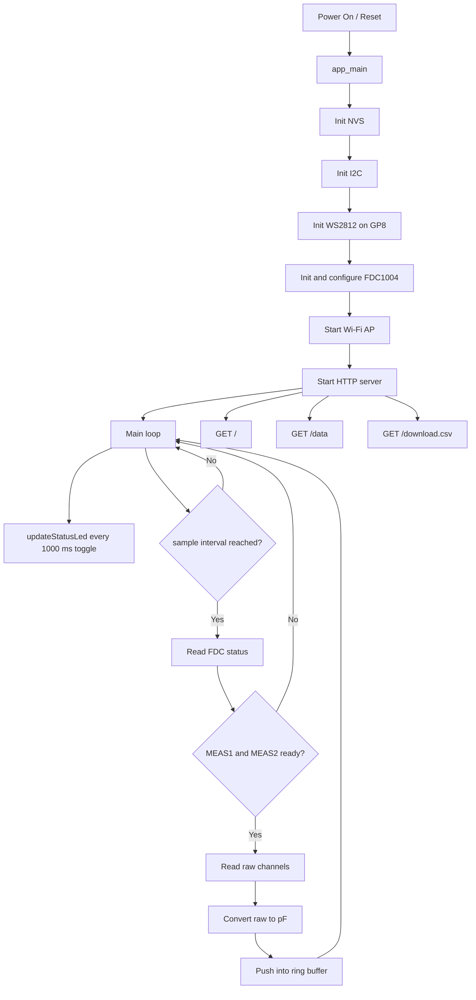

# ESP32-C6 FDC1004 Web Monitor (ESP-IDF + PlatformIO)

This firmware runs on ESP32-C6, reads differential capacitance from an FDC1004 over I2C, serves a live dashboard over Wi-Fi AP, stores samples in RAM for CSV export, and blinks a WS2812 LED green on GP8.

## Firmware Variants

- Original firmware documentation: [README.md](README.md)
- Visual chart firmware documentation: [README_visual.md](README_visual.md)

## Exakte Konfiguration beider Programmvarianten

Die Sensor- und Hardwarekonfiguration ist in beiden Varianten gleich. Unterschiede gibt es hauptsaechlich im Web-Frontend.

### Gemeinsame Konfiguration (main und main_visual)

- Board/Framework: ESP32-C6, ESP-IDF (PlatformIO)
- I2C-Port: I2C_NUM_0
- I2C-Pins: SDA GP1, SCL GP0
- I2C-Takt: 100 kHz
- FDC1004-Adresse: 0x50
- Messmodus: Differential
- Kanalpaare:
   - Messung 1: CH1 - CH3
   - Messung 2: CH2 - CH4
- FDC1004-Rate: 100 SPS
- FDC1004-Betrieb: Repeat aktiv, beide Messkanaele aktiv
- Umrechnung: raw / 524288.0 nach pF (2^-19 pF/LSB)
- Samplingintervall Firmware: 100 ms
- Ringspeicher: 4000 Samples
- HTTP-Endpunkte: /, /data, /download.csv
- Access Point:
   - SSID: ESP32C6-FDC1004
   - Passwort: FDC1004demo
   - Kanal: 1
   - Max. Clients: 4
- WS2812-Status-LED: GP8, 1 s Toggle

### Unterschiede zwischen den Varianten

1. Original (src/main.cpp)
- Webseite mit Live-Werten und CSV-Download
- Browser-Polling fuer /data: alle 500 ms

2. Visual (src/main_visual.cpp)
- Zusaetzlich Live-Chart im Browser (Canvas)
- Browser-Polling fuer /data: alle 500 ms
- Rollendes Zeitfenster im Chart: 60 s
- Dynamische Y-Achse, begrenzt auf -15 pF bis +15 pF

### Wichtiger Hinweis zu unterschiedlichen Messwerten

Wenn du zwischen main und main_visual unterschiedliche Werte siehst, ist die wahrscheinlichste Ursache nicht die FDC1004-Messkonfiguration (die ist identisch), sondern die zusaetzliche Systemlast in der Visual-Variante:

- HTTP-Polling ist jetzt gleich wie im Original (500 ms)
- zusaetzliche Browser-Zeichenarbeit fuer das Live-Chart
- mehr Wi-Fi/HTTP-Aktivitaet waehrend gleichzeitigem Sampling

Die Rohmessung ist in beiden Varianten gleich konfiguriert, aber Timing/Jitter im Gesamtsystem kann die beobachteten Werte geringfuegig beeinflussen.

## Features

- ESP-IDF framework in PlatformIO
- I2C sensor interface (FDC1004, address 0x50)
- Differential channels:
   - CH1 - CH3
   - CH2 - CH4
- Conversion of raw values to pF
- Wi-Fi Access Point mode (device hosts its own network)
- HTTP server with live JSON and CSV download
- WS2812 RGB status LED on GP8, green blink every 1 second toggle

## Hardware Setup

- MCU: ESP32-C6
- FDC1004 SDA: GP1
- FDC1004 SCL: GP0
- I2C clock: 100 kHz
- WS2812 data pin: GP8

## Runtime Flow



## Code Walkthrough

1. Entry point and startup
- [app_main](src/main.cpp#L628) initializes NVS, I2C, WS2812, FDC1004, AP, and HTTP server.

2. Sensor communication
- [i2cWriteRegister16](src/main.cpp#L285) writes 16-bit registers.
- [i2cReadRegister16](src/main.cpp#L300) reads 16-bit registers.
- [initFdc1004](src/main.cpp#L326) verifies IDs and enables measurement channels.
- [sampleSensorIfReady](src/main.cpp#L518) checks ready flags, reads data, converts to pF, and stores samples.

3. Data handling
- Ring buffer stores up to 4000 samples in RAM.
- [rawToPf](src/main.cpp#L375) applies datasheet scale factor.
- [pushSample](src/main.cpp#L380) updates latest values and circular history.

4. Web server endpoints
- [handleIndex](src/main.cpp#L400) serves the dashboard HTML.
- [handleData](src/main.cpp#L405) serves current readings as JSON.
- [handleCsvDownload](src/main.cpp#L419) streams buffered history as CSV.
- [setupWebServer](src/main.cpp#L449) registers the routes.

5. Wi-Fi AP
- [setupAccessPoint](src/main.cpp#L482) starts AP mode and logs IP.

6. WS2812 LED behavior
- [initStatusLed](src/main.cpp#L566) initializes the RMT channel and encoder.
- [updateStatusLed](src/main.cpp#L607) toggles green on/off every 1000 ms.

## HTTP API

1. GET /
- Returns dashboard page with live values.

2. GET /data
- Returns JSON:

```json
{
   "timestamp_ms": 12345,
   "ch1_ch3_pf": 1.234567,
   "ch2_ch4_pf": 0.987654
}
```

3. GET /download.csv
- Returns CSV stream:

```csv
timestamp_ms,ch1_minus_ch3_pf,ch2_minus_ch4_pf
100,1.111111,2.222222
200,1.111222,2.222333
```

## Build and Flash

1. Build

```powershell
pio run -e esp32-c6-devkitc-1
```

2. Flash

```powershell
pio run -e esp32-c6-devkitc-1 -t upload
```

3. Serial monitor

```powershell
pio device monitor -b 115200 --port COM10
```

## Wi-Fi Defaults

- SSID: ESP32C6-FDC1004
- Password: FDC1004demo

After boot, connect to this AP and open the logged IP address (typically 192.168.4.1).

## Notes

- Sample interval is 100 ms.
- Data history depth is 4000 samples.
- Build may show a deprecation warning for legacy I2C driver include; this is non-blocking with current ESP-IDF 6.0.1.
